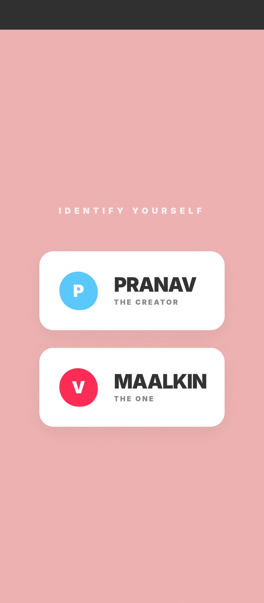
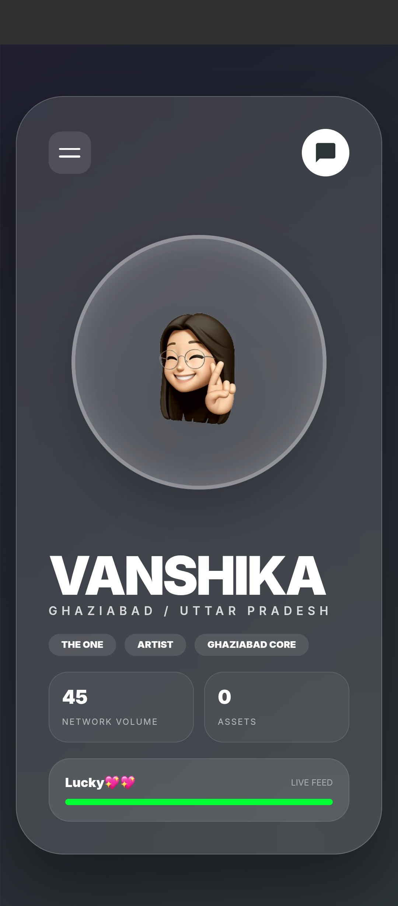
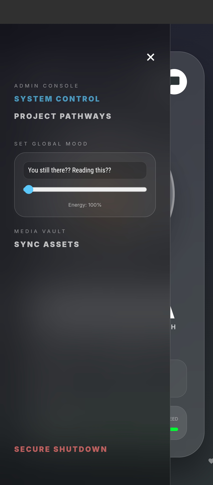
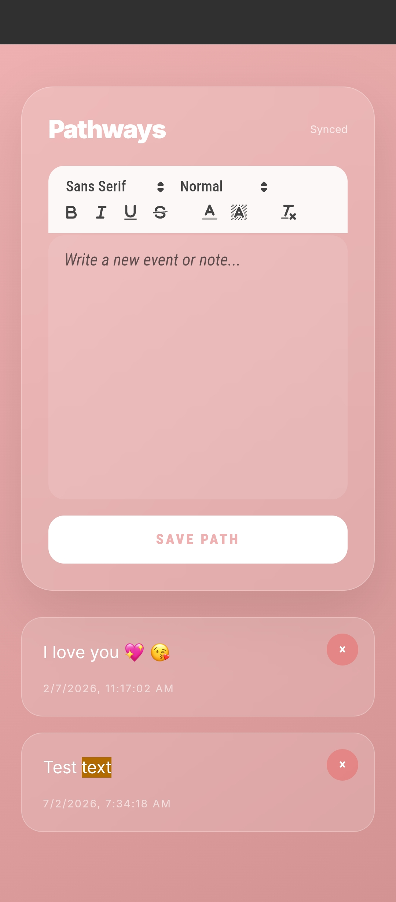
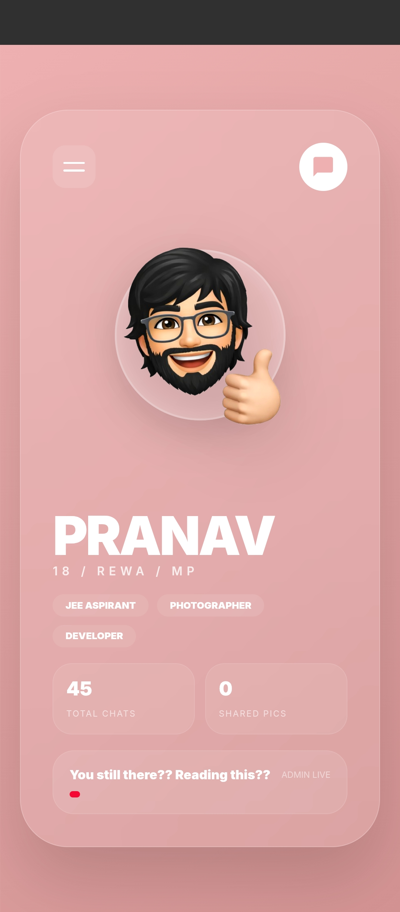
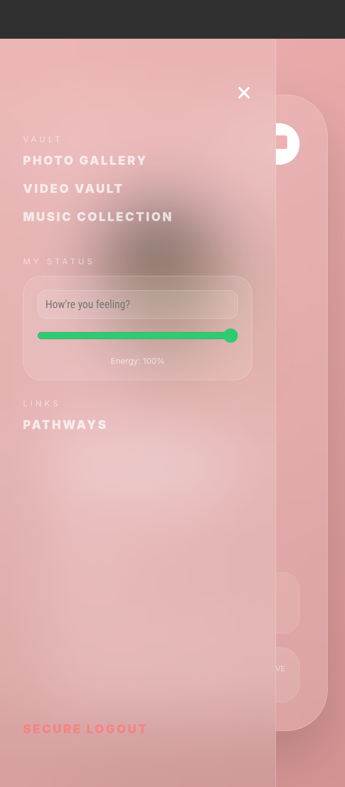
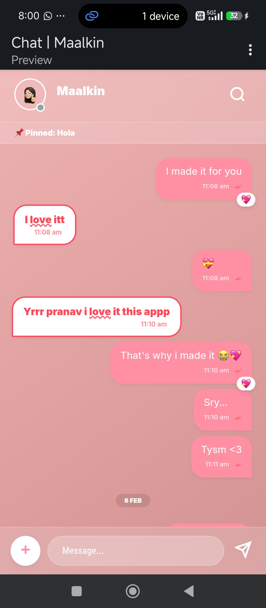

# Chat-App-For-My-Girlfriend 💬

🖤 A Note (Optional Read)
Hey stranger,
if you have some time, read this.
It’s been a year since she ghosted me. Everything was going good — I got attached, and slowly she became a routine instead of just my girlfriend. Maybe that’s where things changed.
I don’t want any of my family members to read or know about this, because it may make things worse. If you’re here, just treat this as a quiet corner of the internet.
You can use my Firebase if you want — I don’t mind.
Good luck....💗
---

## 🚀 Features

- Real-time chat powered by Firebase
- Simple and clean UI
- Fast message sync
- Lightweight and functional
- Personal project turned reusable

---

## 🛠 Tech Stack

- Firebase (Realtime Database / Auth)
- HTML
- CSS
- JavaScript

---

## 📸 App Preview

<p align="center">
  
  
  
</p>

<p align="center">
  
  
  
</p>

<p align="center">
  
  
  
</p>

---

## 📌 How to Use

1. Clone the repository
   ```bash
   git clone https://github.com/pranav-pramod-dwivedi/Chat-App-For-My-Girlfriend.git
